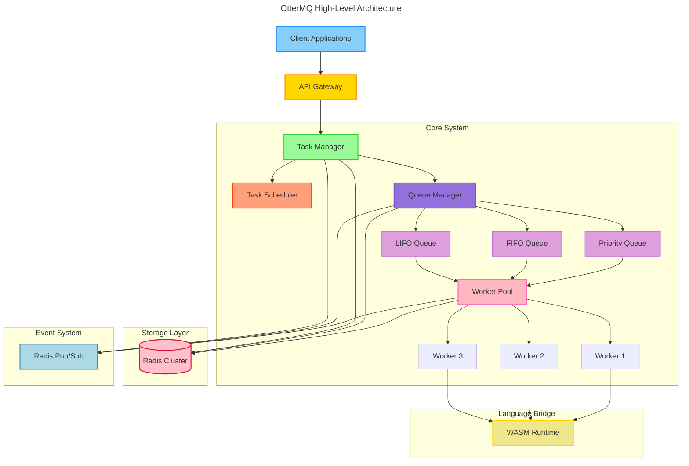

# OtterMQ 🦦

A high-performance, redis-backed distributed task queue system that lets you write workers in any language via WebAssembly. Features priority queuing, task scheduling, dead letter queues, and real-time event monitoring.

[](https://goreportcard.com/report/github.com/username/ottermq)
[](https://godoc.org/github.com/username/ottermq)
[](https://github.com/username/ottermq/blob/master/LICENSE)

<div align="center">
  
</div>


# [Google Doc](https://docs.google.com/document/d/16bNoGTDqS3aZMKqFLrX33sjG0UjE1ZpXwt7kPqTHEiM/edit?usp=sharing)

## 🌟 Features

- **Language Agnostic**: Write workers in any language that compiles to WebAssembly
- **Flexible Queue Types**: FIFO, LIFO, Priority, Delayed, and Composite queues
- **Advanced Task Management**: 
  - Task dependencies and DAG support
  - Scheduled and periodic tasks
  - Batch processing capabilities
  - Task versioning and migration
- **Robust Architecture**:
  - Redis-backed persistence
  - Distributed task processing
  - Auto-scaling worker pools
  - Dead letter queue handling
- **Real-time Monitoring**:
  - Live queue metrics
  - Worker performance tracking
  - Task execution statistics
  - Distributed tracing

## 📋 Table of Contents

- [Quick Start](#-quick-start)
- [Architecture](#-architecture)
- [Use Cases](#-use-cases)
- [Installation](#-installation)
- [Configuration](#-configuration)
- [Examples](#-examples)
- [Documentation](#-documentation)
- [Contributing](#-contributing)
- [License](#-license)

## 🚀 Quick Start

```bash
# Still in DEV
```

## 🏗 Architecture

OtterMQ is built on a modular architecture that prioritizes scalability and flexibility:




## 🎯 Use Cases

> All the code-examples are just a bluff as of now

### 1. Microservices Task Processing
Perfect for distributed systems where tasks need to be processed across different services:
```go
// Create a task chain
task := ottermq.NewTask().
    Then("validate-order").
    Then("process-payment").
    Then("update-inventory").
    Then("send-confirmation")
```

### 2. Background Job Processing
Ideal for handling time-consuming tasks:
```go
// Schedule a periodic task
scheduler.Every(24 * time.Hour).
    At("02:00").
    Run("generate-daily-reports")
```

### 3. Event-Driven Systems
Great for systems requiring real-time event processing:
```go
// Subscribe to task events
events.Subscribe("task.completed", func(e Event) {
    log.Printf("Task %s completed: %v", e.TaskID, e.Result)
})
```

### 4. Cross-Language Task Processing
Write workers in any language that compiles to WebAssembly:

```typescript
// TypeScript worker
export function processTask(payload: any): Result {
    // Process task
    return { status: "success", data: processed }
}
```

```python
# Python worker (compiled to WASM)
def process_task(payload):
    # Process task
    return {"status": "success", "data": processed}
```

## ⚙️ Configuration

OtterMQ can be configured via environment variables, config file, or CLI flags:

```yaml
# config.yaml
redis:
  host: localhost
  port: 6379
  password: ""

queues:
  default:
    type: fifo
    max_size: 1000
    worker_count: 5
  priority:
    type: priority
    levels: 5
    worker_count: 10

monitoring:
  metrics_port: 9090
  tracing_enabled: true
```

## 📊 Monitoring & Metrics

OtterMQ provides comprehensive monitoring capabilities:

- Prometheus metrics endpoint
- Grafana dashboards
- Distributed tracing with OpenTelemetry
- Real-time queue statistics

## 🔧 Development

```bash
# Clone the repository
git clone https://github.com/fofsinx/ottermq.git

# Install dependencies
go mod download

# Run tests
make test

# Build
make build
```

## 🤝 Contributing

Contributions are welcome! Please read our [Contributing Guide](CONTRIBUTING.md) for details on our code of conduct and the process for submitting pull requests.

### Development Prerequisites

- Go 1.21 or higher
- Redis 6.x or higher
- Docker (for development environment)

## 📝 License

OtterMQ is released under the MIT License. See the [LICENSE](LICENSE) file for details.

## 🌟 Stargazers

[](https://github.com/fofsinx/ottermq/stargazers)

## 🔗 Links

- [Documentation](https://ottermq.io/docs)
- [API Reference](https://ottermq.io/api)
- [Examples](https://github.com/username/ottermq/tree/master/examples)
- [Docker Hub](https://hub.docker.com/r/username/ottermq)

---

<div align="center">
  <sub>Built with ❤️ by the OtterMQ Team back in 🇮🇳</sub>
</div>
